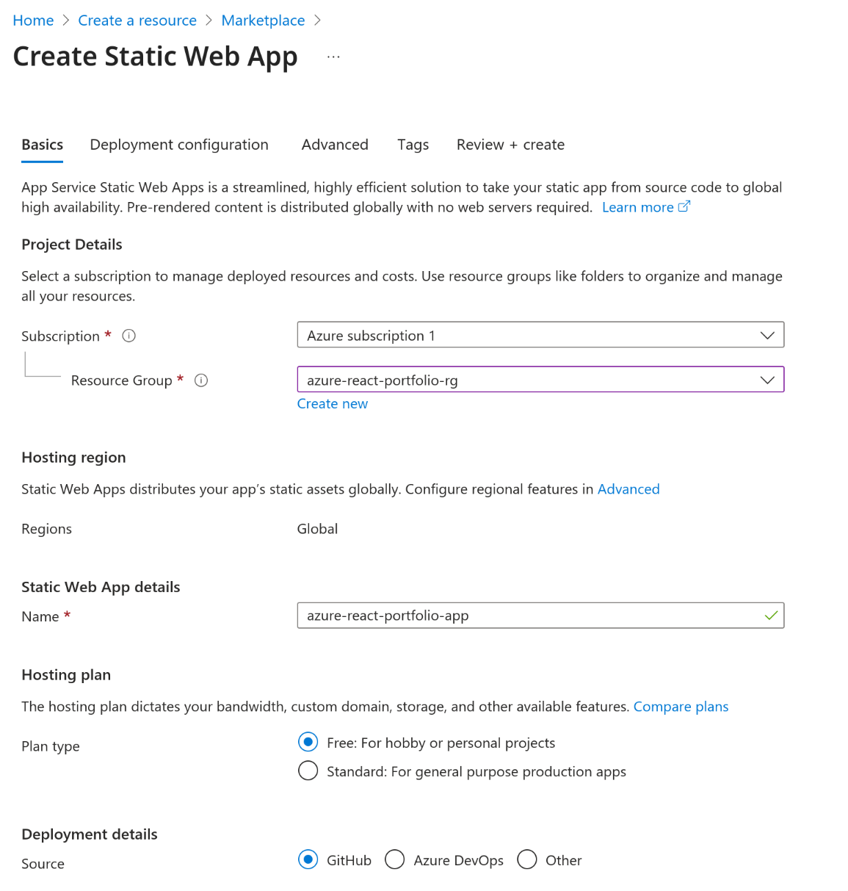
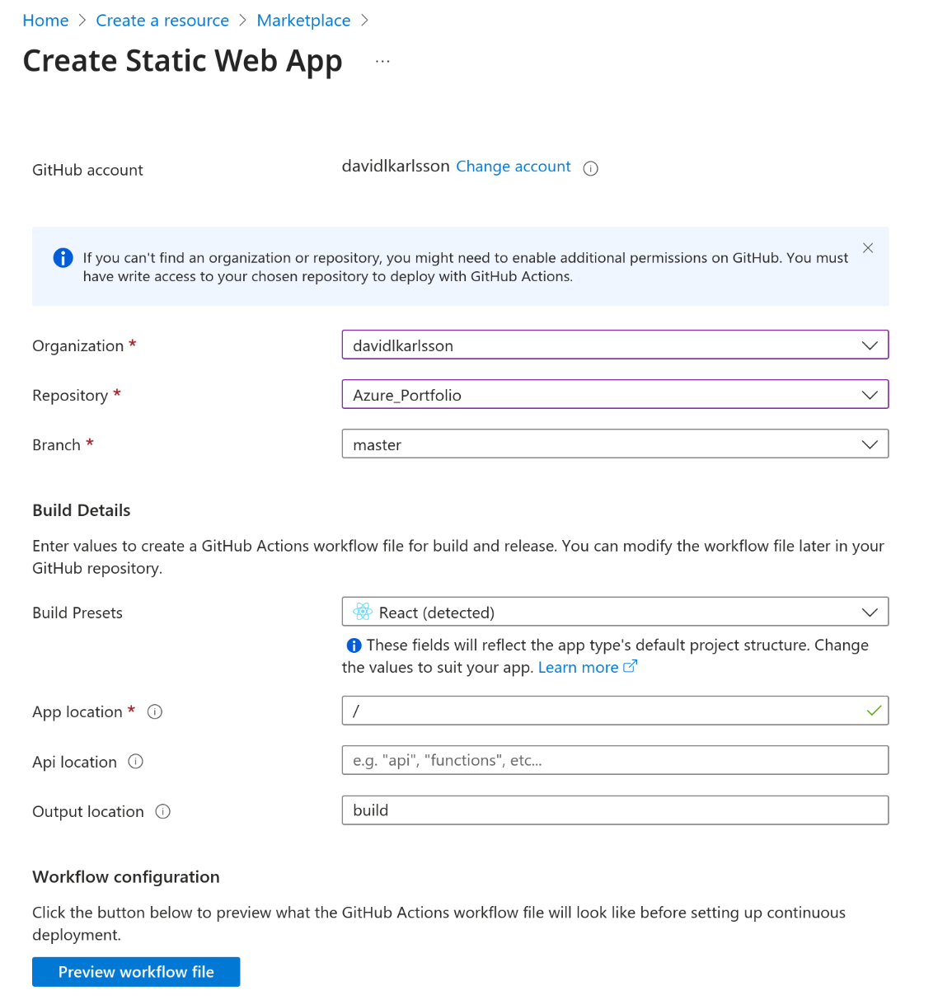
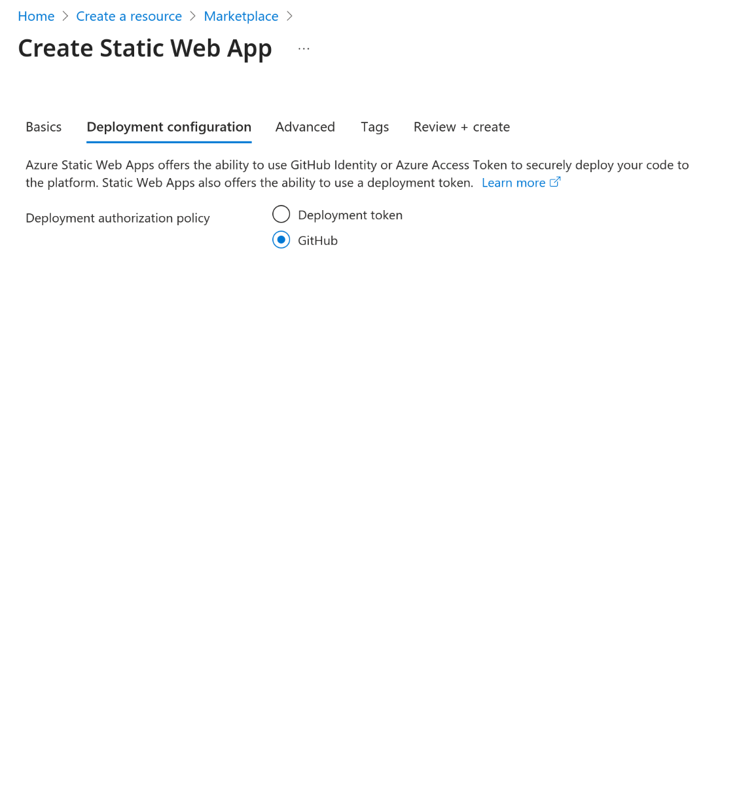
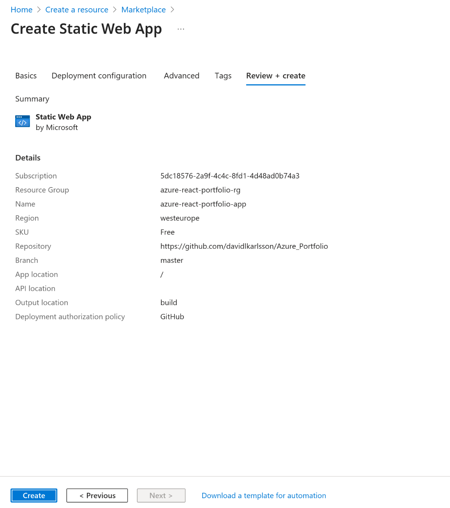
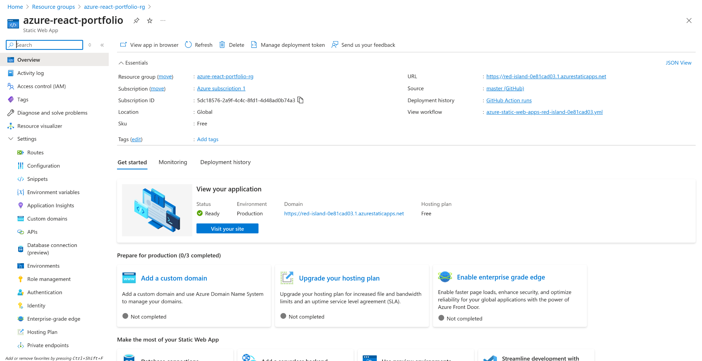

# Lab - Deploying a React App to Azure Static Web Apps

In this lab I learned how to deploy a React application to **Azure Static Web Apps**.  
The goal was to publish my portfolio online and understand how cloud hosting works for modern web applications.

This portfolio was built for practice using React, TypeScript, and Vite.
It includes some projects that I have built during my education, skills, and contact information.


🌐 **Live Demo:** [My portfolio on Azure](https://red-island-0e81cad03.1.azurestaticapps.net/)

---

## 💻 Creating the project locally

I started by creating a new React + TypeScript project with Vite:

```bash
npm create vite@latest my-portfolio -- --template react-ts
cd my-portfolio
npm install

```

Then I tested it locally by running:

```bash
npm run dev

```

Finally, I pushed the project to GitHub so it could be connected to Azure for deployment.


## Azure Portal - Process & Screenshots

### 🔧 Step 1 - Create an Azure Static Web App
I started by creating a new Static Web App resource in the Azure Portal. **Create a resource → Static Web App**.




### 🔧 Step 2 - Connect GitHub repository
Next, I connected my GitHub repository so that Azure could automatically build and deploy the app.






### 🔧 Step 3 - Deploy the App
After reviewing the settings, I clicked Create to deploy the application.





### 🔧 Step 4 - Access the Portfolio
Once the deployment finished, Azure generated a random URL for my application.
This allowed me to instantly access my portfolio live on the internet.





## What I Learned

- How to connect GitHub to Azure for automated deployments.

- That Azure generates a live URL instantly, making it easy to share my portfolio.

- Why cloud deployment is valuable: it makes my projects accessible to others quickly.

Deploying applications to the cloud is an essential skill for modern developers.
This lab shows that I can take a project from local development to a live, production-ready portfolio site.
Thanks to Azure Static Web Apps, I can now present my work to employers and clients in a professional way.

